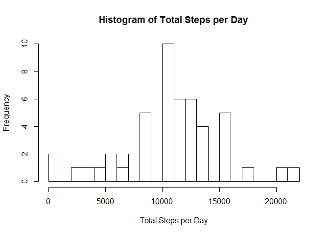
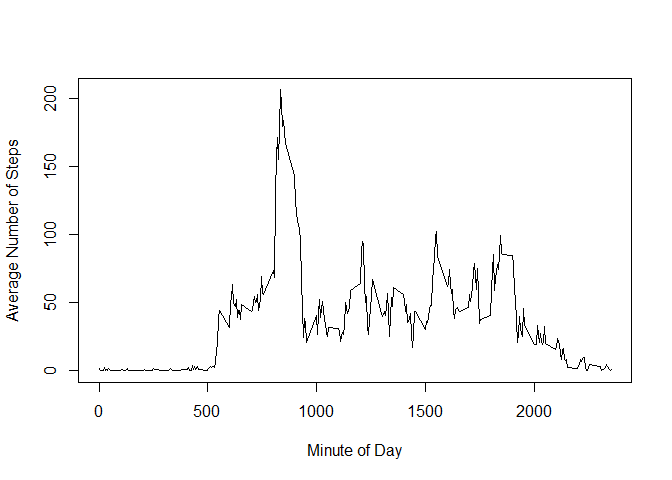
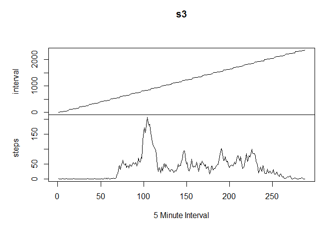
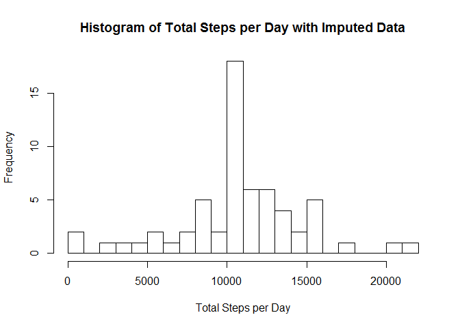
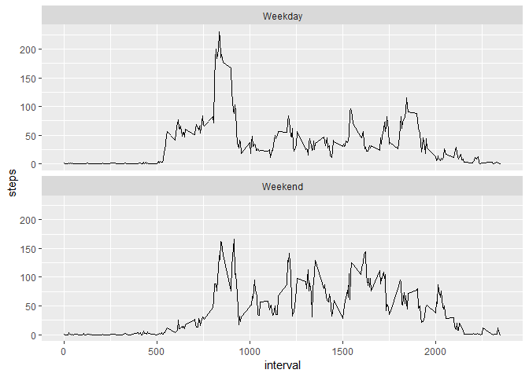

## Loading and preprocessing the data

```r
steps <- read.csv("activity.csv")
```


## What is mean total number of steps taken per day?

```r
s2 <- aggregate(steps ~ date, steps, sum)
hist(s2$steps, breaks = 20, xlab = "Total Steps per Day", main = "Histogram of Total Steps per Day")
```

<!-- -->


What are the mean and median total number of steps taken per day?

```r
mean(s2$steps)
```

```
## [1] 10766.19
```

```r
median(s2$steps)
```

```
## [1] 10765
```

## What is the average daily activity pattern?

```r
s3 <- aggregate(steps ~ interval, steps, mean)
plot(s3, type = "l", xlab="Minute of Day", ylab = "Average Number of Steps")
```

<!-- -->

```r
plot.ts(s3, type = "l", xlab="5 Minute Interval", ylab = "Average Number of Steps")
```

<!-- -->

Which 5-minute interval, on average across all the days in the dataset, contains the maximum number of steps?

```r
s3[which(s3$steps == max(s3$steps, na.rm = TRUE)),]
```

```
##     interval    steps
## 104      835 206.1698
```


## Imputing missing values
What is the total number of missing values in the dataset (i.e. the total number of rows with NAs)

```r
summary(steps)
```

```
##      steps                date          interval     
##  Min.   :  0.00   2012-10-01:  288   Min.   :   0.0  
##  1st Qu.:  0.00   2012-10-02:  288   1st Qu.: 588.8  
##  Median :  0.00   2012-10-03:  288   Median :1177.5  
##  Mean   : 37.38   2012-10-04:  288   Mean   :1177.5  
##  3rd Qu.: 12.00   2012-10-05:  288   3rd Qu.:1766.2  
##  Max.   :806.00   2012-10-06:  288   Max.   :2355.0  
##  NA's   :2304     (Other)   :15840
```

```r
sum(is.na (steps$steps))
```

```
## [1] 2304
```
Create a new dataset that is equal to the original dataset but with the missing data filled in.

```r
replaceNA <-function(x, ave) {
  stepsNa <- which(is.na(x$steps))
  for(val in stepsNa) {
    x[val,]$steps <- ave[which(ave$interval == x[val,]$interval),]$steps
  }
  return(x);
}

sImpute <- replaceNA(steps,s3)
```
A histogram of the total number of steps taken each day.

```r
sImpSum <- aggregate(steps ~ date, sImpute, sum)
hist(sImpSum$steps, breaks = 20, xlab = "Total Steps per Day", main = "Histogram of Total Steps per Day with Imputed Data")
```

<!-- -->

What are the mean and median total number of steps taken per day with imputed data?

```r
mean(sImpSum$steps)
```

```
## [1] 10766.19
```

```r
median(sImpSum$steps)
```

```
## [1] 10766.19
```
The median has changed due to the new values.

## Are there differences in activity patterns between weekdays and weekends?

```r
s6 <- sImpute
s6$date <- as.Date(s6$date)
days2 <- as.factor( ifelse(weekdays(s6$date) %in% c("Monday","Tuesday","Wednesday","Thursday","Friday"), "Weekday", "Weekend" ) )
s6[,"day"] <- days2

sImpAve <- aggregate(steps ~ interval + day, s6, mean)

library("ggplot2")
```

```
## Warning: package 'ggplot2' was built under R version 3.5.2
```

```r
p1 <- ggplot(sImpAve, aes(interval, steps)) + geom_line() + facet_wrap(~day, ncol = 1)
plot(p1)
```

<!-- -->


